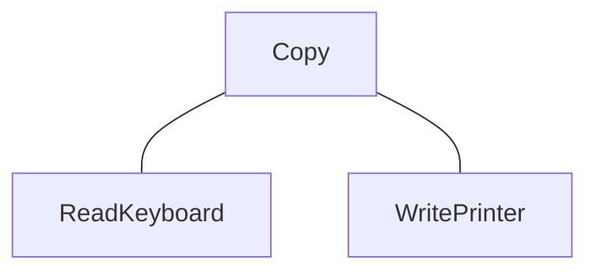
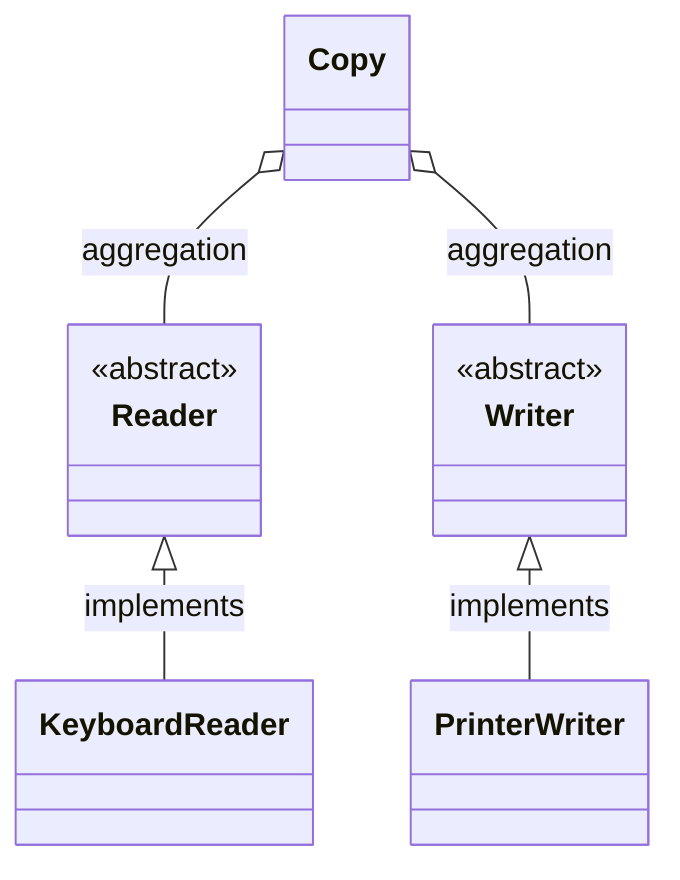
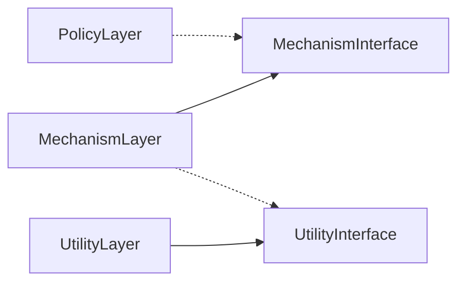
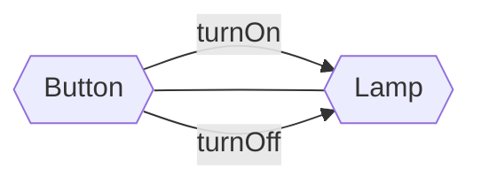
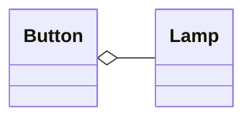
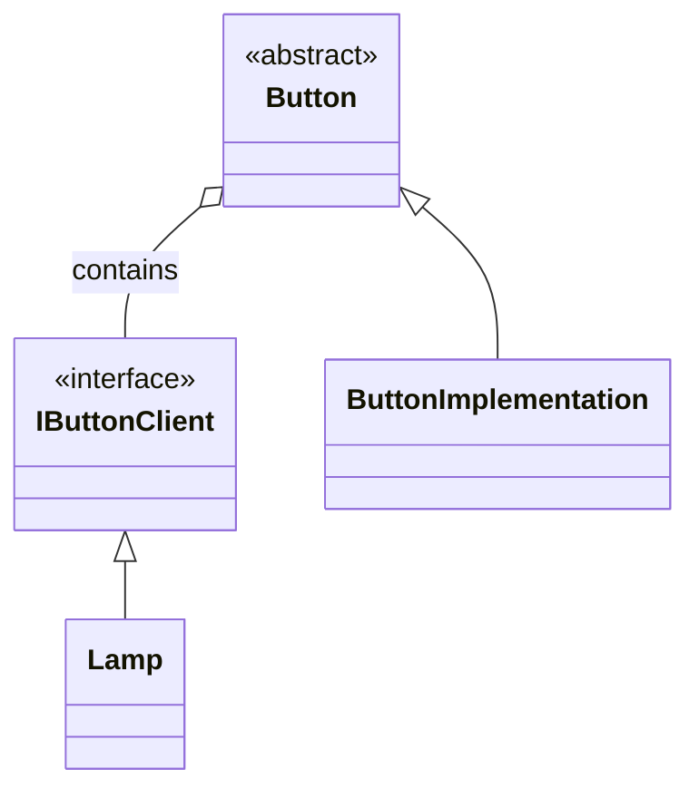
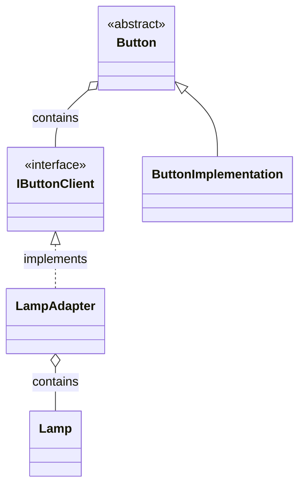

# Princípio de Inversão de Dependência

**`Aviso! Este texto abaixo é uma tradução do artigo de Robert C. Martin feito em 1996 para a revista` [_C++ Report_](https://web.archive.org/web/20110714224327/http://www.objectmentor.com/resources/articles/dip.pdf). O texto pode conter alterações para o melhor entendimento dos leitores**

Esta é a terceira coluna do meu _caderno de engenharia_ para a _C++ Report_. Os artigos que aparecem nesta coluna se concentram no uso de C++ e OOD (Oriented Object Design - Design Orientado a Objetos) e abordam questões de software engenharia.

Vou me esforçar para artigos serem pragmáticos e diretamente úteis ao engenheiro de software em seu dia-a-dia.

Nesses artigos eu farei uso da nova Linguagem de Modelagem unificada definida for Booch e Rumbaugh (UML Versão 0.8) para documentar projetos orientados a objetos.

## **`Introdução`**

Meu último artigo (março de 1996) falou sobre o `Princípio da Substituição de Liskov (LSP)`.

Este princípio, quando aplicado a C++ ou C#, fornece orientação para o uso de herança pública.

Esse princípio diz que cada função que opera sobre uma referência ou ponteiro para uma classe base, deve ser capaz de
operar sobre derivadas dessa classe base sem saber.

Isso significa que o funções virtuais membras de classes derivadas (classes filha) não devem esperar mais do que o membro correspondente
funções da classe base (classe pai) e não deve prometer menos.

Isso também significa que funções virtuais que estão presentes nas classes base também devem estar presentes nas classes derivadas e
elas devem fazer um trabalho útil.

Quando este princípio é violado, as funções que operam ponteiros ou referências a classes base precisarão verificar o tipo do objeto real para
certifique-se de que eles podem operá-lo corretamente. Esta necessidade de verificar o tipo viola a
`Princípio Aberto-Fechado (OCP)` que discutimos em janeiro passado.

Nesta coluna, discutimos as implicações estruturais do `OCP` e do `LSP`. o
A estrutura que resulta do uso rigoroso desses princípios pode ser generalizada em um princípio por si só. Eu chamo isso de “O Princípio da Inversão de Dependência” (DIP).

## **`O que há de errado com o software?`**

A maioria de nós já teve a experiência desagradável de tentar lidar com um software que tem um “design ruim”.

Alguns de nós até tiveram a experiência muito mais desagradável de descobrir que éramos os autores do software com o “mau design”.

O que torna um projeto ruim?

A maioria dos engenheiros de software não se propõe a criar “designs ruins”.

Ainda a maioria dos softwares eventualmente se degrada ao ponto de alguém declarar que o projeto não é sólido.

Por que isso acontece?

O design era ruim desde o começo, ou o design realmente se degradou como um pedaço de carne podre? No centro desta questão está a nossa falta de um bom trabalho definição de design “ruim”.

## **`Definição de um "Design Ruim"`**

Você já apresentou um projeto de software, do qual se orgulhava especialmente, para revisão por um colega? Esse colega disse, com um sorriso de deboche e lamentação, algo como: “Por que você fez isso dessa maneira?".

Certamente isso já aconteceu comigo, e já vi acontecer com muitos outros engenheiros também.

Claramente, os engenheiros discordantes não estão usando os mesmos critérios para definir o que é “projeto ruim”.

O critério mais comum que vi usado é o `TNTWIWHDI` ou critério “Não é assim que eu teria feito” (`That’s not the way I would have done it`).

Mas há um conjunto de critérios que acho que todos os engenheiros concordarão. Um pedaço de software que atende aos seus requisitos e ainda exibe qualquer um ou todos os três seguintes traços tem um design ruim.

1. É difícil mudar porque cada mudança afeta muitas outras partes do sistema. (`Rigidez`)
2. Quando você faz uma alteração, partes inesperadas do sistema quebram. (`Fragilidade`)
3. É difícil reutilizar em outro aplicativo porque não pode ser desembaraçado do
o aplicativo atual. (`Imobilidade`)

Além disso, seria difícil demonstrar que um software que não exibe nenhuma dessas características, ou seja, é flexível, robusto e reutilizável, e que também cumpre todos os seus requisitos, tenha um design ruim. Assim, podemos usar essas três características como uma forma de decidir de forma clara se um design é “bom” ou “ruim”.

## **`A causa do "Design Ruim"`**

O que torna um design rígido, frágil e imóvel?

### Rigidez

É a interdependência de módulos dentro desse projeto. Um projeto é rígido se não puder ser facilmente alterado.

Tal `rigidez` é devido ao fato de que uma única mudança em um software altamente interdependente inicia uma cascata de mudanças em módulos dependentes.

Quando a extensão dessa cascata de mudança não pode ser prevista pelos projetistas e/ou mantenedores, o impacto da mudança não pode ser estimado.

Isso torna o custo da mudança impossível de prever. Os gerentes, diante de tamanha imprevisibilidade, ficam relutantes em autorizar mudanças. Assim, o design torna-se oficialmente
rígido.

### Fragilidade

`Fragilidade` é a tendência de um programa quebrar em muitos lugares quando uma única mudança é feita.

Muitas vezes os novos problemas estão em áreas que não têm relação conceitual com o área que foi alterada.

Tal fragilidade diminui muito a credibilidade do projeto e organização de manutenção.

Usuários e gerentes são incapazes de prever a qualidade de seus produtos.

Mudanças simples em uma parte do aplicativo levam a falhas em outras partes que parecem não estar completamente relacionados.

Corrigir esses problemas leva a ainda mais problemas, e o processo de manutenção começa a se assemelhar a um cachorro correndo atrás do próprio rabo.

### Imobilidade

Um projeto é imóvel quando as partes desejáveis do projeto são altamente dependentes sobre outros detalhes que não são desejados.

Designers encarregados de investigar o design para ver se ele pode ser reutilizado em uma aplicação diferente pode ficar impressionado com o quão bem o design faria no novo aplicativo.

No entanto, se o design for altamente interdependente, então esses designers também ficarão assustados com a quantidade de trabalho necessária para separar as parte desejáveis do projeto das outras partes do projeto que são indesejáveis.

Na maioria dos casos, tais projetos `não são reutilizados` porque o custo da `separação é considerado ser superior ao custo de redesenvolvimento` do projeto.

## **`Exemplo: o programa “Copiar”`**

Um exemplo simples pode ajudar para fazer este ponto.

Considere um programa simples que é encarregado com a tarefa de copiar caracteres digitados em um teclado para um impressora. Suponha, ainda,
que a plataforma de implementação não tem um sistema operacional que suporta a independência do dispositivo.

Poderíamos conceber uma estrutura para este programa que se parece com a Figura 1:



_Figura 1: diagragram/gráfico de estrutura._

A Figura 1 é um “gráfico de estrutura”¹. Mostra que existem três módulos, ou subprogramas, na aplicação.

O módulo `Copy` chama os outros dois. Pode-se facilmente imaginar um loop dentro do módulo `Copy`. (Consulte a Listagem 1.)

O corpo desse loop chama o módulo `ReadKeyboard` para buscar um caractere do teclado e, em seguida, envia esse caractere para o Módulo `WritePrinter` que imprime o caractere.

```csharp
public class CopyProgram
{
    public void Copy()
    {
        int c;
        while ((c = ReadKeyboard()) != -1)
            WritePrinter(c);
    }
}
```

_Listagem 1: o programa “Copiar”._

Os dois módulos de baixo nível são bem reutilizáveis. Eles podem ser usados em muitos outros programas para ter acesso ao teclado e a impressora.

Este é o mesmo tipo de reutilização que ganhamos com bibliotecas de sub-rotina.

No entanto, o módulo `Copy` não é reutilizável em nenhum contexto que não envolva um teclado ou uma impressora.

Isso é uma pena, pois a inteligência do sistema é mantida em este módulo.

É o módulo `Copy` que encapsula uma política muito interessante que poderiamos reutilizar.

Por exemplo, considere um novo programa que copia caracteres do teclado para um arquivo de disco.

Certamente gostaríamos de reutilizar o módulo `Copy`, pois ele encapsula o alto nível política que precisamos, ou seja, ele sabe como copiar caracteres de uma fonte para um coletor.

Infelizmente, o módulo `Copy` depende do módulo `WritePrinter` e, portanto, não pode ser reutilizado no novo contexto.

Nós certamente poderíamos modificar o módulo `Copy` para dar-lhe o novo comportamento desejado. (Ver Listagem 2).

Poderíamos adicionar um `if` à sua política e fazer com que ele selecione entre os módulos `WritePrinter` e `WriteDisk` dependendo de algum tipo de flag.

No entanto, esta alteração adiciona novas interdependências ao sistema.

Com o passar do tempo, e mais e mais dispositivos deve participar do programa de cópia, o módulo `Copy` estará repleto de instruções `if/else` e dependerá de muitos módulos de nível inferior. 

Acabará por se tornar `rígido e frágil`.

```csharp
public class CopyProgram
{
    public enum OutputDevice { printer, disk };
    public void Copy(outputDevice dev)
    {
        int c;
        while ((c = ReadKeyboard()) != -1)
            if (dev == printer)
                WritePrinter(c);
            else
                WriteDisk(c);
    }
}
```

_Listagem 2. O Programa de Cópia “Aprimorado”._

## **`Inversão de Dependência`**

Uma forma de caracterizar o problema acima é notar que o módulo que contém o política de alto nível, ou seja, o módulo `Copy()`, depende dos módulos detalhados de baixo nível que ele controla, ou seja, `WritePrinter()` e `ReadKeyboard()`.

Se pudéssemos encontrar uma maneira de fazer o módulo `Copy()` independente dos detalhes que ele controla, então poderíamos reutilizá-lo livremente.

Poderíamos produzir outros programas que utilizassem este módulo para copiar caracteres de qualquer dispositivo de saída.

OOD nos dá um mecanismo para realizar essa inversão de dependência.

Considere o diagrama de classes simples na Figura 2.

Aqui temos uma classe `Copy` que contém uma classe abstrata `Reader` e uma classe abstrata `Writer`.

Pode-se facilmente imaginar um loop dentro da classe `Copy` que pega caracteres de seu `Reader` e envia para seu `Writer` (veja a Listagem 3).

Ainda esta classe `Copy` não depende da classe `Keyboard Reader` nem da classe `PrinterWriter` em tudo.

Assim as dependências foram invertidas, a classe `Copy` depende de abstrações, e o leitores e escritores detalhados dependem nas mesmas abstrações.



_Figura 2: diagrama de classe._

```csharp
public abstract class Reader
{
    public virtual int Read();
}

public abstract class Writer
{
    public virtual void Write(char c);
}

public class Copy
{
    public void Copy(Reader reader, Writer writer)
    {
        int c;
        while((c = reader.Read()) != -1)
            writer.Write(c);
    }
}
```

_Listagem 3: O Programa de Cópia Orientado a Objetos._

Agora podemos reutilizar a classe `Copy`, independentemente da classe `KeyboardReader` e da classe `PrinterWriter`.

Podemos inventar novos tipos de classes derivadas `Reader` e `Writer` que podemos fornecer à classe `Copy`.

Além disso, não importa quantos tipos de “Leitores” e “Escritores” são criados, a classe `Copy` não dependerá de nenhum deles.

Não haverá interdependências para tornar o programa frágil ou rígido. E o método `Copiar()` em si pode ser usado em muitos outros contextos detalhados. É móvel.

## Independência do dispositivo

Até agora, alguns de vocês provavelmente estão dizendo a si mesmos que poderiam obter os mesmos benefícios escrevendo o método `Copy()` em C#, usando a biblioteca `System.IO`, ou seja, `Console.Read()` e `Console.Write()` (Consulte a Listagem 4).

```csharp
public class Copy
{
    public void Copy()
    {
        int c;
        while((c = Console.Read()) != -1)
            Console.Write(Convert.ToChar(c));
    }
}
```

_Listagem 4: O Programa de Cópia usando System.IO._

Se você observar as Listagens 3 e 4 cuidadosamente, você perceberá que os dois são logicamente equivalentes.

As classes abstratas na Figura 3 foram substituído por um tipo diferente de abstração na Listagem 4.

É verdade que a Listagem 4 não usa classes e funções virtuais puras, mas ainda usa abstração e polimorfismo para alcançar suas extremidades.

Além disso, ainda usa inversão de dependência! O programa Copiar na Listagem 4 faz não depende de nenhum dos detalhes que controla. Em vez disso, depende das facilidades abstratas declaradas na biblioteca `System.IO`.

Além disso, os periféricos de entrada e saída que são eventualmente invocados também dependem das abstrações declaradas em `System.IO`.

Assim o dispositivo independência dentro da biblioteca `System.IO` é outro exemplo de inversão de dependência.

Agora que vimos alguns exemplos, podemos falar de forma geral do `DIP`.

## **`O Princípio de Inversão de Dependência`**

O princípio baseia-se em dois conceitos:

1. MÓDULOS DE ALTO NÍVEL NÃO DEVEM DEPENDER DE MÓDULOS BAIXO DE NÍVEL. AMBOS DEVEM DEPENDER DE ABSTRAÇÕES.
2. ABSTRAÇÕES NÃO DEVEM DEPENDER DE DETALHES. DETALHES DEVE DEPENDER DAS ABSTRAÇÕES.

Alguém pode questionar por que eu uso a palavra “inversão”.

Francamente, é porque métodos de desenvolvimento de software mais tradicionais, como Análise Estruturada e Design, tendem a criar estruturas de software em que módulos de alto nível dependem de módulos de baixo nível, e em quais abstrações dependem de detalhes.

De fato, um dos objetivos desses métodos é definir a hierarquia do subprograma que descreve como os módulos de alto nível fazem chamadas para os módulos de baixo nível.

A Figura 1 é um bom exemplo dessa hierarquia. Assim, a estrutura de dependência de um programa orientado a objetos bem projetado é “invertida” em relação a a estrutura de dependência que normalmente resulta de métodos procedurais tradicionais.

Considere as implicações de módulos de alto nível que dependem de módulos de baixo nível.

São os módulos de alto nível que contêm as decisões políticas importantes e os modelos de negócios de um aplicativo.

São esses modelos que contêm a identidade do aplicativo.

Ainda, quando esses módulos dependem dos módulos de nível inferior, então mudanças no módulo de baixo nível podem ter efeitos diretos sobre os módulos de alto nível podendo forçá-los a mudar também.

Essa situação é absurda! São os módulos de alto nível que deveriam forçar o módulos de baixo nível para mudar.

São os módulos de alto nível que devem ter precedência sobre os módulos de nível inferior. **`Módulos de alto nível simplesmente não devem depender módulos de baixo nível de qualquer forma`**.

Além disso, são módulos de alto nível que queremos poder reutilizar.

Nós já estamos bons o bastante em reutilizar módulos de baixo nível na forma de bibliotecas de sub-rotinas.

Quando módulos de alto nível dependem de módulos de baixo nível, torna-se muito difícil reutilizá-los em diferentes contextos.

No entanto, quando os módulos de alto nível são independentes dos módulos de baixo nível, os módulos de alto nível podem ser reutilizados de forma bastante simples.

Este é o princípio que está no coração do design de estrutura.

## **`Camadas`**

De acordo com Booch²:

> "...todas as arquiteturas orientadas-a-objetos bem estruturadas têm camadas claramente definidas, <br>
> com cada camada fornecendo alguns conjuntos de serviços coerentes através de uma interface bem definida e controlada”.

Uma interpretação ingênua dessa afirmação pode levar um projetista a produzir uma estrutura semelhante à Figura 3.


_Figura 3: Camadas Simples._

Neste diagrama, a classe de política de alto nível usa um mecanismo de nível inferior, que por sua vez usa uma classe de utilitário de nível detalhado.

Embora isso possa parecer apropriado, isso pode nos levar a crer de que a camada de política é sensível a mudanças em todo o caminho até Camada de Utilidade.

A dependência é transitiva.

A Camada de Política depende algo que depende na Camada de Utilidade, assim a Camada de Política depende transitivamente do Camada de Utilidade.

Isto é muito lamentável.



_Figura 4: Camadas Abstratas._

A Figura 4 mostra um modelo mais apropriado.

Cada uma das camadas de nível inferior são representadas por uma classe abstrata. As camadas reais são então derivadas dessas classes abstratas.

Cada uma das classes de nível superior usa a próxima camada mais baixa através da interface abstrata.

Assim, nenhuma das camadas depende de qualquer uma das as outras camadas.

Em vez disso, as camadas dependem de classes abstratas.

Não é apenas a dependência transitiva da Camada de Política sobre Camada de Utilidade que é quebrada, mas até mesmo a dependência direta da Camada de Política sobre a camada do mecanismo é quebrada.

Quebrada aqui tem o sentido de separada das demais.

### **Um Exemplo Simples**

Usando este modelo, a Camada de Política não é afetada por quaisquer alterações na Camada de Mecanismo ou na Camada de Utilidade.

Além disso, a camada de política pode ser reutilizada em qualquer contexto que defina módulos de baixo nível que estão em conformidade com a interface da Camada de Mecanismo.

Assim, invertendo as dependências, criamos uma estrutura simultaneamente mais flexível, durável e Móvel.

## **`Separando Interface de Implementação em C#`**

**`Esta parte do artigo não foi traduzida porque é um exemplo específico para a linguagem C++. Em C# podemos facilmente separar nossa interface de sua implementação.`**

### **Exemplo Simples**

A inversão de dependência pode ser aplicada sempre que uma classe envia uma mensagem para outra.

Por exemplo, considere o caso do objeto `Button` e do objeto `Lamp`.

O objeto `Button` detecta o ambiente externo.

Ele pode determinar se um usuário o “pressionou”.

Não importa qual seja o mecanismo de detecção.

Pode ser um botão ícone em uma GUI (Graphical User Interface - Interface Gráfica do Usuário, vulgo Tela), um botão físico sendo pressionado por um dedo humano ou até mesmo um detector de movimento em um sistema de segurança residencial.

O objeto `Button` detecta que um usuário ativou ou o desativou.

O objeto `Lamp` afeta o ambiente externo.

Ao receber uma mensagem `TurnOn`, ele acende uma luz de algum tipo.

Ao receber uma mensagem `TurnOff` ele apaga essa luz.

O mecanismo físico não é importante.

Pode ser um LED em um console de computador, uma lâmpada de vapor de mercúrio em um estacionamento, ou mesmo o laser em uma impressora a laser.

Como podemos projetar um sistema tal que o objeto `Button` controla o objeto `Lamp`? A Figura 5 mostra um modelo ingênuo. o

O objeto `Button` simplesmente envia a mensagem de ligar e desligar para a Lâmpada.

Para facilitar isso, a classe `Button` usa um relacionamento “`contém`” para manter um instância da classe `Lamp`.





_Figura 5: Modelo de botão/lâmpada ingênuo._

A Listagem 5 mostra o código C# que resulta desse modelo.

Observe que a classe `Button` depende diretamente da classe da `Lamp`.

Na verdade, a classe `Button` usa a classe `Lamp`.

Essa dependência implica que a classe `Button` deve mudar, ou pelo menos ser recompilada sempre que a classe `Lamp` sofrer mudanças. 

Além disso, não será ser possível reutilizar a classe `Button` para controlar um objeto do tipo `Motor`.

```csharp

public class Lamp
{
    public void TurnOn() { }
    public void TurnOff() { }
}

public class Button
{
    private Lamp itsLamp;

    public Button(Lamp lamp) 
    {
        itsLamp = lamp;
    }

    public void Detect()
    {
        bool buttonOn = GetPhysicalState();
        if (buttonOn)
            itsLamp.TurnOn();
        else
            itsLamp.TurnOff();
    }
}

```

_Listagem 5: O Código Botão/Lâmpada Ingênuo._

A Figura 5 e a Listagem 5 violam o princípio de inversão de dependência.

O política de alto nível do aplicativo não foi separado dos módulos de baixo nível.

As abstrações não foram separadas dos detalhes.

Sem tal separação, a política de alto nível depende automaticamente dos módulos de baixo nível, e as abstrações dependem automaticamente dos detalhes.

## **`Encontrando a abstração subjacente`**

Qual é a política de alto nível?

São as abstrações que fundamentam a aplicação, a verdades que não variam quando os detalhes são alterados.

No exemplo Botão/Lâmpada, a abstração subjacente é detectar um gesto de ligar/desligar de um usuário e retransmitir esse gesto para um objeto alvo. 

_Qual mecanismo é usado para detectar o gesto do usuário?_

`Irrelevante!`

_O que é objeto alvo?_

Irrelevante!

Esses são detalhes que `não afetam a abstração`.

Para estar de acordo com o princípio da inversão de dependência, devemos isolar essa abstração dos detalhes do problema.

Então nós devemos direcionar as dependências do design de tal forma que os detalhes dependam das abstrações.

A Figura 6 mostra tal projeto.



_Figura 6: Modelo de botão invertido._

Na Figura 6, isolamos a abstração da classe `Button` a partir de sua implementação detalhada.

A Listagem 6 mostra o código correspondente.

Observe que a política de alto nível é inteiramente capturada dentro da classe abstrata `Button`³.

A classe abstrata `Button` não sabe nada sobre o mecanismo físico para detectar os gestos do usuário e não sabe nada sobre a lâmpada.

Esses detalhes são isolados dentro dos derivados concretos: `ButtonImplementation` e `Lamp`.

```csharp

public interface IButtonClient
{
    void TurnOn();
    void TurnOff();
}

public abstract class Button
{
    private IButtonClient itsClient;

    public Button(IButtonClient client)
    {
        itsClient = client;
    }

    public void Detect()
    {
        bool buttonOn = GetState();
        if (buttonOn)
            itsClient.TurnOn();
        else
            itsClient.TurnOff();
    }

    public virtual bool GetState();
}

public abstract class Lamp : IButtonClient
{
    public virtual void TurnOn();
    public virtual void TurnOff();
}

public class ButtonImplementation : Button
{
    public ButtonImplementaton(IButtonClient client) : base(client)
    {

    }
}

```

A política de alto nível na Listagem 6 é reutilizável com qualquer tipo de botão e com qualquer tipo de dispositivo que precisa ser controlado. 

Além disso, não é afetado por alterações nos mecanismos de baixo nível.

Assim, é robusto na presença de mudanças, flexível e reutilizável.

## **`Estendendo ainda mais a abstração`**

Talvez poderia fazer uma reclamação legítima sobre o design na Figura/Listagem 6.

O dispositivo controlado pelo botão deve ser derivado de `IButtonClient`.

E se a classe `Lamp` vier de uma biblioteca de terceiros e não podemos modificar o código-fonte?

A Figura 7 demonstra como o padrão [`Adapter`](https://refactoring.guru/pt-br/design-patterns/adapter) pode ser usado para conectar um terceiro objeto da lâmpada para o modelo.

A classe `LampAdapter` simplesmente traduz a mensagem `TurnOn` e `TurnOff` herdada de `IButtonClient`, em quaisquer mensagens que a classe `Lamp` precise ver.



_Figura 7: Lamp Adapter._

## **`Conclusão`**

O princípio da inversão de dependência está na raiz de muitos dos benefícios reivindicados para tecnologia orientada a objetos.

Sua aplicação adequada é necessária para a criação de materiais reutilizáveis estruturas.

Também é criticamente importante para a construção de código que seja resiliente à mudança.

E, como as abstrações e detalhes são todos isolados uns dos outros, o código é muito mais fácil de manter.

Este artigo é uma versão extremamente condensada de um capítulo do meu novo livro: Patterns and Advanced Principles of OOD, a ser publicado em breve pela Prentice Hall.

Nos artigos subsequentes, exploraremos muitos dos outros princípios do design orientado a objetos.